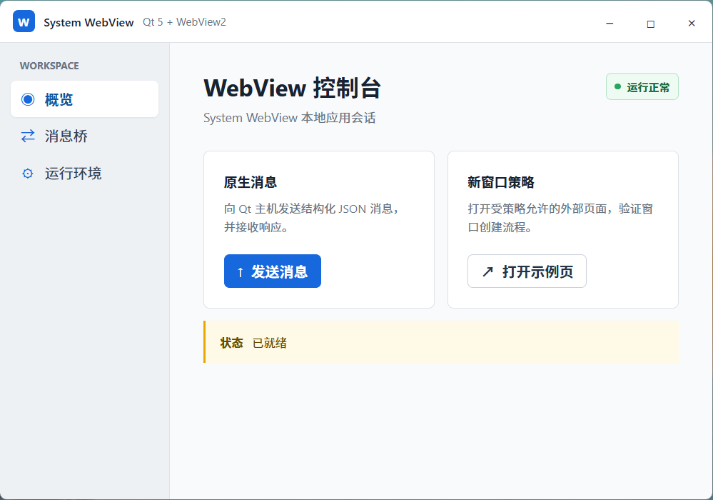

<div align="center">

# System WebView

一个在 Qt 5 C++ 应用中嵌入系统 WebView 的轻量库。

<p>
  <a href="https://en.cppreference.com/w/cpp/17"></a>
  <a href="https://www.qt.io/"></a>
  
  
</p>

[English](README.md) | **简体中文**

</div>

<p align="center">
  
</p>

System WebView 用一套适合 Qt 的接口封装 Windows 上的 Microsoft WebView2 和 macOS 上的 WKWebView。平台 SDK 类型不会暴露到业务代码中，应用层只需要使用 Qt 值类型和公开的 C++ 接口。

## 功能

- 持久化和临时浏览器会话
- 本地资源包、开发服务器和远程站点三种页面来源
- C++ 与页面之间经过结构校验的 JSON 消息
- 导航、弹窗、权限、下载和文件选择策略回调
- Qt 控件中的原生视图挂载与尺寸同步
- 可通过 `system_webview::system_webview` 安装和引用的 CMake 包

示例程序还包含一套网页实现的无边框标题栏和窗口按钮。Windows 下的圆角与桌面阴影由 DWM 绘制。

## 平台支持

| 平台 | 内核 | 工具链 | 说明 |
| --- | --- | --- | --- |
| Windows AMD64 | Microsoft WebView2 | MSVC v143、Qt 5.15 | 需要 WebView2 Evergreen Runtime |
| Windows ARM64 | Microsoft WebView2 | MSVC、Qt 5.15 | 使用 vcpkg 的 `arm64-windows` triplet |
| macOS | WKWebView | Apple Clang、Qt 5.15 | 使用系统 WebKit 框架 |

目前不支持 Linux。WebKit2GTK 仅保留了接口映射设计，还没有实现。

## 在 Windows 上构建

预设默认使用仓库相邻目录中的 vcpkg，也就是 `../vcpkg`。先安装当前架构所需的 Qt 和 WebView2 SDK：

```powershell
..\vcpkg\vcpkg install qt5-base:x64-windows webview2:x64-windows
```

构建 ARM64 时，将 `x64-windows` 换成 `arm64-windows`。

打开与目标架构一致的 MSVC 开发者命令行，然后配置、构建并运行测试：

```powershell
cmake --preset windows-msvc-amd64-debug
cmake --build --preset windows-msvc-amd64-debug
ctest --preset windows-msvc-amd64-debug --output-on-failure
```

运行示例：

```powershell
.\build\windows-msvc-amd64-debug\samples\demo\system_webview_demo.exe
```

vcpkg 提供 WebView2 SDK 和 Loader。目标电脑仍需安装与架构匹配的 Microsoft Edge WebView2 Evergreen Runtime。

## 在 macOS 上构建

macOS 预设默认从 `/opt/homebrew/opt/qt@5` 查找 Homebrew Qt 5：

```sh
brew install cmake ninja qt@5
cmake --preset macos-appleclang-debug
cmake --build --preset macos-appleclang-debug
ctest --preset macos-appleclang-debug --output-on-failure
./build/macos-appleclang-debug/samples/demo/system_webview_demo
```

创建真实 WKWebView 的测试需要在已登录的图形桌面中运行，并且能够访问 WindowServer。

## 接入项目

创建会话，注册页面来源，再把视图挂载到 Qt 控件中：

```cpp
webview::WebViewPolicyConfig policyConfig;
policyConfig.allowedAppHosts.insert(QStringLiteral("dashboard"));

webview::WebViewSessionOptions sessionOptions;
sessionOptions.mode = webview::SessionMode::Ephemeral;

auto session = webview::createWebViewSession(
    std::move(sessionOptions),
    webview::createDefaultWebViewPolicy(std::move(policyConfig)));

webview::WebApplicationOptions appOptions;
appOptions.id = QStringLiteral("dashboard");
appOptions.source = webview::LocalBundle { QStringLiteral("/path/to/vite/dist") };
appOptions.bridgeAccess = webview::BridgeAccess::Allowed;

auto application = session->createApplication(std::move(appOptions));
auto view = session->createWebView(parentWidget);
view->open(application, QStringLiteral("/orders/42"));
view->attachNativeView();
```

`LocalBundle` 适合打包后的网页资源，例如 Vite 的 `dist` 目录。开发环境可使用 `DevelopmentServer`，部署后的站点使用 `RemoteOrigin`。如果开发服务器使用 HTTP，还需要把完整来源加入 `trustedDevelopmentOrigins`。

只要应用或视图仍在使用，就要保留它所属的会话。`WebViewPtr` 同时管理原生视图的生命周期；如果宿主控件要求显式清理，请在销毁前执行 detach 和 close。

## 安装到其他 CMake 项目

仓库默认安装到 `install/`。也可以使用标准 CMake 参数指定其他目录：

```sh
cmake -S . -B build/release -DCMAKE_BUILD_TYPE=Release \
  -DSYSTEM_WEBVIEW_BUILD_SAMPLES=OFF \
  -DCMAKE_INSTALL_PREFIX=/path/to/system-webview
cmake --build build/release
cmake --install build/release
```

在使用方项目中引用安装后的包：

```cmake
find_package(system_webview CONFIG REQUIRED)
target_link_libraries(my_app PRIVATE system_webview::system_webview)
```

配置使用方项目时，把 `CMAKE_PREFIX_PATH` 指向上面的安装目录。

## 更多文档

- [架构与生命周期](docs/ARCHITECTURE.md)
- [平台行为矩阵](docs/platform-version-and-behavior-matrix.md)
- [架构决策记录](docs/adr/README.md)
- [设计规格](docs/specs/)

平台行为矩阵会区分已经实现的代码与真实桌面环境中的运行证据。依赖 WKWebView 和 WebView2 的差异化能力前，建议先查看该文档。
