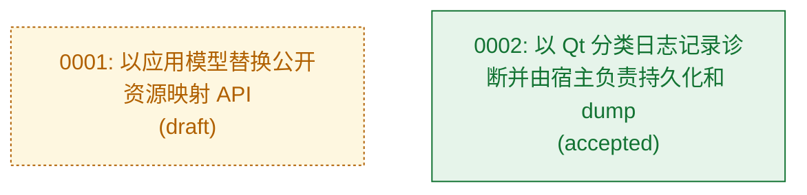

# 架构决策记录 (ADR)

> 最后修改时间：2026-09-24 18:29 CST
> 文档版本：v2
> 修改说明：将诊断日志与 dump 职责决策加入架构决策地图。

<!-- lite-arch:begin -->

## 架构决策地图

<!-- lite-arch:end -->

## 版本修改记录

| 版本 | 修改时间 | 修改内容 |
| --- | --- | --- |
| v1 | 创建时 | 建立架构决策地图。 |
| v2 | 2026-09-24 18:29 CST | 将诊断日志与 dump 职责决策加入架构决策地图。 |
