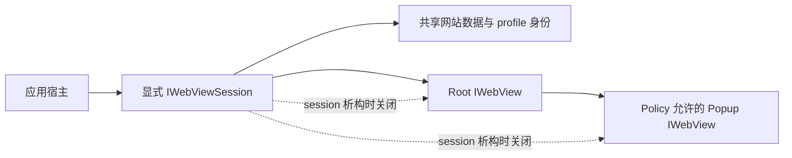
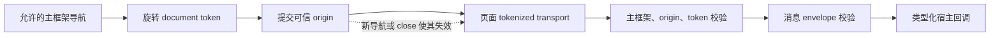

# WebView Session 与 Policy API - 施工交工单

> 独立性: true | mode=reviewer-subagent | requested_model=gpt-5.6-sol
> 日期: 2026-08-13

## 先看结论

这轮实现通过了最终独立审查，整体判定为 `pass`。决定性证据来自一次全新构建：16/16 个构建步骤完成，core/session 测试 2/2 通过，真实 WindowServer 环境中的 WKWebView 页面测试 1/1 通过。当前范围内没有遗留缺口。仍不能声称 WebView2 与 WebKit2GTK 已实现或经过生产测试，它们本来就不在本轮实现范围内。

## 这份交工单告诉你什么

这份文档把批准的设计、实际代码、Git 提交、测试和最终独立审查放在一起，供接口维护者和后续平台实现者查阅。它说明本轮改了什么、证据能支持哪些结论，也保留证据的边界。它不会替代运行结果，不会把 macOS 证据套到另外两个后端，也不会把 policy 接线说成完整的下载管理或系统授权 UI。

## 你现在可以确定什么

| 你关心的问题 | 判定 | 直接答案 | 关键证据 | 可信度 | 结论边界 | 下一步 |
|---|---|---|---|---|---|---|
| Does the public API require explicit sessions and fully remove the superseded standalone and unrestricted bridge APIs? | pass | Yes. Applications create persistent or ephemeral sessions and create pages from those sessions. The standalone view factory and direct page message, popup, and unrestricted postMessage APIs have no public compatibility wrappers or production references. | src/webview/WebViewFactory.h:10; src/webview/IWebViewSession.h:18; src/webview/IWebView.h:16; samples/demo/DemoWindow.cpp:77; docs/ARCHITECTURE.md:18 | high | This is intentionally source-breaking; no implicit default session or migration shim is retained. | No action is required within this mission. |
| Do macOS views in one session share profile resources while ephemeral sessions use non-persistent storage? | pass | Yes. Views and permitted popups in one macOS session share WKWebsiteDataStore and WKProcessPool identity while receiving separate content controllers. Ephemeral sessions use nonPersistentDataStore. | src/platform/macos/WkWebViewSession.mm:21; src/platform/macos/WkWebViewSession.mm:42; tests/WkSessionTests.mm:39; tests/WkViewTests.mm:372; 2026-08-12_21-42-53-webview-session-policy-api.validation.md:25 | high | profilePath is logical on macOS, and the API does not promise process isolation beyond native platform capabilities. | Keep the documented platform limit when implementing additional backends. |
| Are lifecycle, navigation, popup, and close semantics observable and enforced without stale callbacks? | pass | Yes. The macOS backend emits ordered lifecycle events with stable navigation IDs, exposes redirect context to policy, supports stop and reload, rejects disallowed navigation and missing popup handlers, gives allowed popups session ownership, and suppresses callbacks after close or session destruction. | src/platform/macos/WkWebView.mm:273; src/platform/macos/WkWebView.mm:358; src/platform/macos/WkWebView.mm:524; src/platform/macos/WkWebView.mm:543; src/platform/macos/WkWebViewSession.mm:31; tests/WkViewTests.mm:242; tests/WkViewTests.mm:279; tests/WkViewTests.mm:335; tests/WkViewTests.mm:372; 2026-08-12_21-42-53-webview-session-policy-api.validation.md:25 | high | The file-panel user gesture, download destination UI, and privacy prompts remain explicitly unautomated; those limits do not weaken the lifecycle or callback guarantees. | No action is required within this mission. |
| Can only a trusted current main frame exchange size-, version-, type-, and schema-validated bridge messages? | pass | Yes. Native code requires the current main frame, matching committed trusted origin, and the current rotating document token before validating the bounded versioned envelope. Stale same-origin tokens and iframe raw-handler calls are rejected, while outbound data uses WebKit argument binding rather than source interpolation. | src/platform/macos/WkWebView.mm:119; src/platform/macos/WkWebView.mm:177; src/platform/macos/WkWebView.mm:577; src/webview/WebViewPolicy.cpp:64; tests/WkViewTests.mm:151; tests/WkViewTests.mm:204; tests/WkViewTests.mm:221; 2026-08-12_21-42-53-webview-session-policy-api.validation.md:25 | high | Native argument binding requires macOS 11 or later; older systems return the typed Unsupported result. | Apply equivalent frame, origin, generation, and data-binding checks in future WebView2 and WebKit2GTK backends. |
| Is the common contract implementable on WKWebView, WebView2, and WebKit2GTK without exposing native profile types? | pass | Yes at the approved contract-design level. Public headers contain portable Qt/C++ interfaces and capability discovery, while the architecture documentation maps sessions, lifecycle, popups, and bridge validation to all three native designs without exposing their profile objects. | src/webview/IWebViewSession.h:12; src/webview/IWebView.h:11; src/webview/WebViewTypes.h:15; src/webview/WebViewPolicy.h:26; docs/ARCHITECTURE.md:58 | moderate | Only WKWebView is implemented and production-tested. This answer does not claim that WebView2 or WebKit2GTK backends exist or pass integration tests. | Validate the mapping with platform integration suites when each future backend is implemented. |

## 决定整体状态的结果

成功条件是：demo 和 macOS 生产路径都通过显式 session 与统一 policy 工作，生命周期和 bridge 隔离有真实测试支撑。最终 clean build 完成 16/16，core/session 测试通过 2/2，WindowServer 页面测试通过 1/1。实现状态、验证状态和 macOS 能力结论都是 `pass`；三后端的共同接口设计也通过审查，但另外两个后端仍未实现。

## 目前仍不能声称什么

| 不能声称的结论 | 原因 | 解除条件 |
|---|---|---|
| WebView2 and WebKit2GTK backends are implemented or production-tested. | They are explicit non-goals of this mission. | Implement each backend and run its platform integration suite. |
| The library provides a universal download manager. | The mission defines policy semantics but excludes a universal download manager. | Approve and implement a separate download API mission. |
| Profiles have stronger process isolation than each native backend provides. | The specification explicitly limits this guarantee to platform capabilities. | Document and implement backend-specific isolation capabilities where supported. |

## spec 目标逐条对账

| spec 目标 | 状态 | 实际效果 | 备注 |
|---|---|---|---|
| 用显式 session 取代单页直建 | 完成 | 应用先选择持久或无痕登录态，再从 session 创建所有页面。 | 旧 standalone factory、page-level bridge/popup setter 和 backend 直建入口都已删除，没有兼容 shim。 |
| 让生命周期、导航、popup 与关闭语义可观察 | 完成 | 宿主能接收稳定导航编号、redirect、失败事件，调用 stop/reload，并接管获准 popup。 | session 析构会关闭仍由宿主持有的 root 与 popup。 |
| bridge 只属于当前可信主文档 | 完成 | 每份主文档都有新 token；native 同时核对主框架、committed origin、token 与消息 schema。 | iframe raw 调用、同源旧 token、恶意出站字符串都有真实测试。 |
| 公共接口可映射三套 system WebView | 完成（设计层） | 业务代码只接触 Qt/C++ 类型与 capability discovery。 | WKWebView 已实现；WebView2、WebKit2GTK 只有映射文档。 |
| demo 使用生产所有权模型 | 完成 | demo 持有一个 session，从它创建 tab，并通过 tokenized transport 与 native 通信。 | tab 销毁前调用 `close()`。 |

## 施工细节

### 所有权与创建路径

改之前，每个页面可以独立创建，profile、policy 与 tab 生命周期没有统一边界。现在只有 session 能创建 view；session 持有 profile 资源和 policy，并登记 root 与 popup。销毁 session 会先关闭登记中的页面，再释放 policy。

实际场景是：demo 创建一个无痕 session，从中打开首页；用户触发获准 popup 后，子页面进入新 tab，但仍沿用同一 session 的网站数据。root 或 popup 即使被外部 `unique_ptr` 留住，session 销毁后也只剩一个可安全析构、`isClosed()` 为真的 inert 对象。

### 导航与文档权限

每次允许的主框架新导航都会在加载前旋转 document token（文档令牌）。native 另外记录 committed origin、navigation id 和 provisional redirect 状态。入站消息需要依次通过主框架、origin、token、大小、版本、类型和 schema 检查；出站消息用 WebKit 参数绑定传数据，不拼接 JavaScript 源码。

同源跳转后，旧文档排队中的消息会因为 token 过期被拒绝。带有 `</script>` 一类内容的 native 消息会原样作为数据到达页面，不会变成可执行源码。

### 权限与下载

media capture、file picker、navigation download 和不可展示响应都会进入类型化 policy。默认规则是拒绝；backend 无法表达的能力通过 session capability discovery 返回 `Unsupported`。file picker 与 media delegate 共用同一生产 permission mapping，避免测试和 native 回调各走一套判断。

### 三后端接口边界

公共头文件没有 `WKWebsiteDataStore`、`CoreWebView2Environment` 或 `WebKitWebContext`。架构文档把 session、lifecycle、popup 和 bridge 分别映射到 WKWebView、WebView2 与 WebKit2GTK。macOS 的 `profilePath` 是逻辑 profile 标识，不承诺任意持久目录；`WKProcessPool` 在现代 macOS 上也不代表额外进程隔离。

## 验证情况

2026-08-13 在 macOS 26.6.1、Apple clang 21.0.0、CMake 4.3.3 上从空的临时目录完成验证：configure 成功，build 16/16，core/session 2/2，真实 WKWebView page suite 1/1。页面测试覆盖加载、redirect、reload、stop、失败、popup 拒绝与允许、bridge token、iframe、hostile payload、download response、close race 和 session 析构。

几项系统 UI 没有自动化：脚本触发 file input 不具备 WebKit 用户激活，因此没有弹出真实文件面板；允许下载后的目标选择与落盘不属于本轮 universal download manager 范围；camera/microphone 的系统隐私提示和物理设备采集也未跑。生产共用的默认拒绝、policy 调用和 capability mapping 已测试，报告没有把这些替代证据写成 OS UI 已通过。

## 后续可操作

当前 mission 没有未完成项。复现 macOS 证据时，按验证报告从 clean build 开始；core/session 测试可普通运行，`webview_macos_view_tests` 需要已登录的 WindowServer 会话。

后续若要实现 WebView2 或 WebKit2GTK，应单独立项并为各自平台补 integration suite。若产品需要完整文件选择或下载目标 UI，也应另开 host UI/download API 任务，不能从本轮 policy 语义推断这些能力已经存在。
