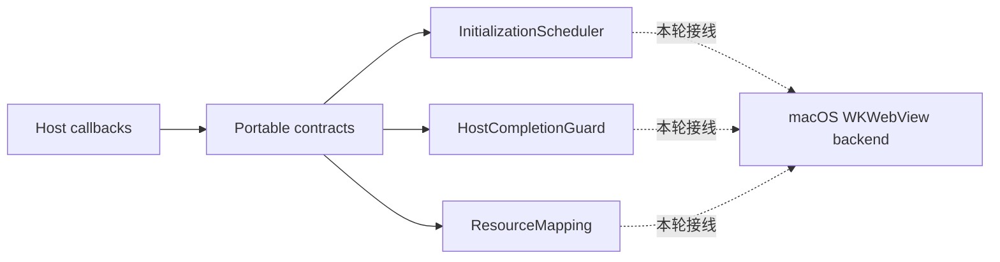

# Portable WebView Contract Hardening 施工交工单

> 独立性: true | mode=reviewer-subagent | requested_model=gpt-5.6-sol | observed_model=unknown
> 日期: 2026-08-15

## 先看结论

本轮按 `docs/specs/2026-08-15-portable-webview-contract-hardening.md` 完成了公共 WebView 契约加固，整体判定为 `partial`。代码、构建、core/session 测试和静态边界检查已经收口；真实 WKWebView GUI 测试因为当前环境没有屏幕，在创建窗口前中止。最重要的边界是：这轮没有实现 Windows WebView2、vcpkg 接入或 Runtime 发布。

## 这份交工单告诉你什么

这份文档把批准的设计、落地代码、测试结果和独立 review 放在一起说明，供后续 Windows 实现直接查阅。它只说明公共契约和 macOS 实现目前到了哪里，不把源码检查或单元测试写成真实 GUI 运行结果。

## 你现在可以确定什么

| 你关心的问题 | 判定 | 直接答案 | 关键证据 | 可信度 | 结论边界 | 下一步 |
|---|---|---|---|---|---|---|
| 异步host completion在重复、延迟、关闭后和跨线程调用时是否安全且结果明确？ | partial | Shared one-shot guards, weak ownership, QPointer dispatch, and structured outcomes are wired for file selection and downloads; duplicate, closed, and destroyed-owner behavior has unit coverage, but real WK delegate and worker-thread completion were not observed in this no-screen environment. | src/webview/HostCompletion.cpp; src/platform/macos/WkWebView.mm; tests/JsonMessageTests.cpp; ctest core/session 2/2 | moderate | Actual WKWebView delegate execution and Cocoa thread affinity remain GUI-limited. | Run webview_macos_view_tests in a logged-in WindowServer session. |
| 公共初始化调度是否真正控制macOS生产路径中的attach、load、setHtml和session clear？ | pass | InitializationScheduler controls attach, load, setHtml, and session clear production paths; queued operations receive Ready, Failed, or Closed and the macOS synchronous-ready path uses the same entry point. | src/webview/WebViewState.cpp; src/platform/macos/WkWebView.mm:588; src/platform/macos/WkWebViewSession.mm; webview_core_tests; webview_macos_session_tests | high | The current macOS backend initializes synchronously, so delayed initialization is proven by shared scheduler tests and production wiring rather than a delayed WK startup. | Use the same scheduler contract when adding the asynchronous WebView2 backend. |
| app资源映射是否真实加载相对资源并阻止root之外的文件访问？ | partial | Mapping validation, canonical-root checks, traversal and symlink rejection, MIME selection, and WKURLSchemeHandler registration are implemented; the real mapped page could not load because the view test aborted before window creation. | src/webview/ResourceMapping.cpp; src/platform/macos/WkWebView.mm; src/platform/macos/WkWebViewSession.mm; webview_core_tests; webview_macos_view_tests: no screens | moderate | Relative CSS, JavaScript, image, and fetch requests were not observed inside a live WKWebView. | Run the mapped-resource cases in a logged-in WindowServer session. |
| popup所有权、规范化origin和capability查询是否已经消除矛盾或配置依赖，并保持编译期backend选择？ | pass | Popup ownership is transferred by value, origin-bearing requests share one normalizer, capability queries describe backend/runtime support rather than session options, and backend selection remains compile-time only. | src/webview/WebViewTypes.h; src/webview/ResourceMapping.cpp; src/platform/macos/WkWebView.mm; src/platform/macos/WkWebViewSession.mm; CMakeLists.txt; static source scan | high | This establishes the portable contract and macOS behavior only; no Windows backend was implemented. | Map WebView2 behavior to these contracts in a separate approved Windows mission. |

## 决定整体状态的结果

实现状态是完成：公共接口、macOS 消费路径、测试和文档都已经落地。验证状态是受限：非 GUI 测试通过，GUI 测试没有越过窗口创建。由此得到的能力结论是 `partial`，不是代码缺口，而是缺少真实 WKWebView 运行证据。

## 目前仍不能声称什么

| 不能声称的结论 | 原因 | 解除条件 |
|---|---|---|
| Windows WebView2 backend、vcpkg接入或Runtime发布已经完成。 | 这些内容是批准规范的明确Non-goal。 | 单独批准并执行Windows backend任务并取得Windows集成证据。 |
| WKWebView、WebView2和WebKit2GTK的原生API行为完全相同。 | 本任务只统一公共可观察结果。 | 各平台实现完成后逐项验证能力与行为映射。 |

## Spec 目标逐条对账

| spec 目标 | 状态 | 实际效果 | 备注 |
|---|---|---|---|
| Host completion 最多生效一次，关闭后不访问已释放状态，并在所属 UI 线程调用原生 API | 部分完成 | host 可以异步完成文件选择和下载目标，重复或过期结果会被拒绝 | 代码和单测已验证，真实 WK delegate 仍需 GUI 运行 |
| 初始化期间的操作统一排队，并在 Ready、Failed、Closed 时得到明确结果 | 完成 | 后续 WebView2 可以直接复用 attach、load、setHtml 和 session clear 的排队规则 | macOS 同步 Ready 也走同一入口 |
| app 资源映射验证 origin 和 canonical root，并阻止越界访问 | 部分完成 | 非法 mapping 会让 session 初始化失败，越界、symlink、目录和缺失文件会被拒绝 | 资源处理器已接入，真实页面相对资源加载待 GUI 验证 |
| popup ownership、origin、capability 和 backend 选择不再产生矛盾 | 完成 | popup 只有一处所有权转移；origin 统一；能力不再随 session 选项变化；平台仍由宏和 CMake 选择 | Windows backend 不在本轮范围 |

## 施工细节

文件选择和下载不再由 backend 自己弹 UI 或猜路径。host 发起自己的异步流程，返回结构化结果；公共 guard 处理重复、关闭和 owner 销毁，macOS 再把原生 completion 调回 Qt UI context。

初始化逻辑也从平台代码中抽了出来。你在初始化完成前调用 `load()` 或 `setHtml()`，操作会排队；初始化失败或 view 关闭时，调用方会收到明确失败结果，不会静默消失。

资源映射现在先验证 `app://host` 和本地 canonical root，再由私有 `WKURLSchemeHandler` 提供文件。路径穿越、编码后的 `..`、指向 root 外的 symlink、目录和缺失文件都会失败。这里最薄弱的不是实现，而是当前机器无法创建 GUI 窗口，所以还没看到真实页面里的 CSS、JavaScript、图片和 fetch 请求。

下载能力按实际实现声明。macOS 11.3 及以上声明 `DownloadTarget`，不再把未实现的浏览器默认下载写成 Supported。profile、private mode 和 resource mapping 则描述 backend 能力，不依赖当前 session 恰好选了什么配置。

## 验证情况

`cmake --build build/debug -j 4` 成功；`webview_core_tests` 和 `webview_macos_session_tests` 通过。完整 `ctest` 为 2/3，`webview_macos_view_tests` 报 `Cannot create window: no screens available`，因此没有把 GUI 场景记为通过。

## 后续可操作

在已登录且有屏幕的 macOS 会话运行 `./build/debug/webview_macos_view_tests`。预期 file/download completion、popup、mapped resource、bridge 和 native geometry 用例全部通过。Windows WebView2 实现应单独立项，并以本轮公共接口为上位契约，不增加动态插件或 runtime backend registry。
